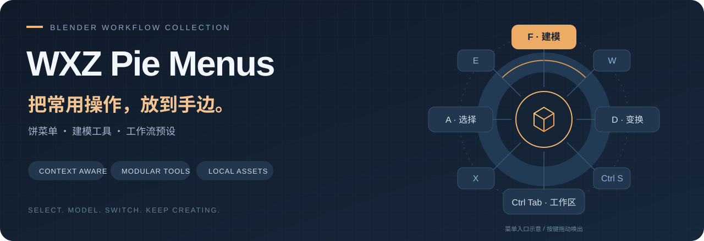
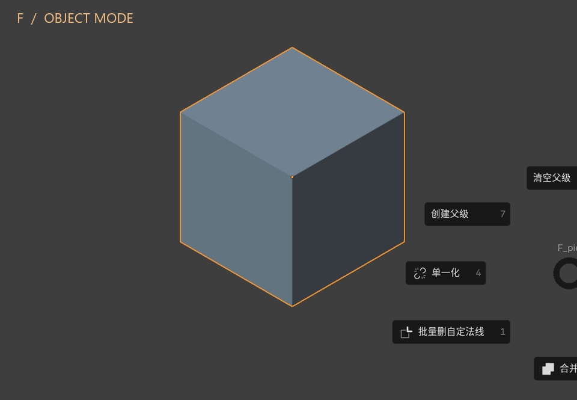
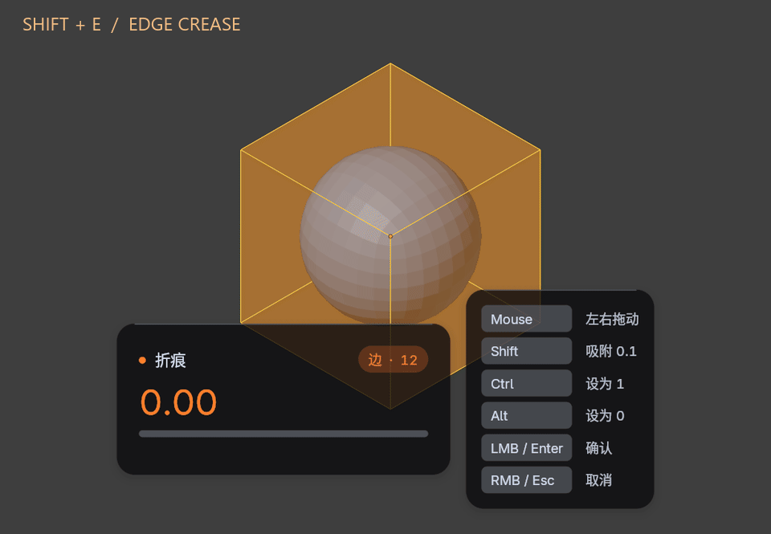
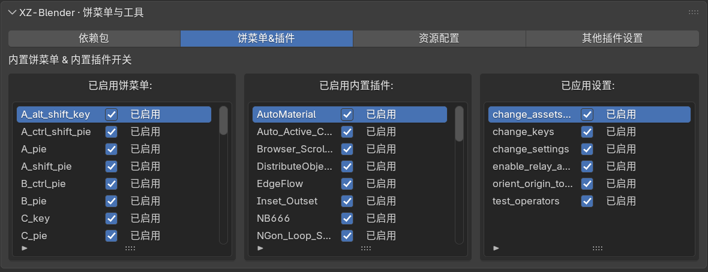

<div align="center">



# WXZ Pie Menus

**为 Blender 整理的一套饼菜单、实用工具与作者工作流预设。**

按键拖动打开菜单，让选择、建模、变换、文件管理和工作区切换更顺手。


[功能概览](#功能概览) · [动态演示](#动态演示) · [开始使用](#开始使用) · [快捷键速查](#快捷键速查) · [常见问题](#常见问题)

</div>

> [!IMPORTANT]
> **启用前请备份个人配置与快捷键。** 功能模块默认开启；“资源配置”中的资源库、快捷键、通用设置和外部插件预设默认关闭，打开相应开关后会按作者预设修改配置，并可在后续启动时再次应用。已有用户请以保存的开关为准。
>
> 清单的最低版本是 **Blender 4.2.0**，但当前 `wheels/` 含 **Windows x64 / CPython 3.13** 二进制依赖。最低版本声明不等于任意 4.2+ 环境均可安装，请使用与完整发行包配套的 Blender。

## 功能概览

| 工作场景 | 可以做什么 | 主要入口 |
| --- | --- | --- |
| **选择与建模** | 扩展／缩减选择、循环边、内插、拆分、桥接、法线处理；按物体／编辑模式展示不同菜单 | `A`、`F`、`E`、`X` 饼菜单 |
| **变换与整理** | 切换坐标系和轴心点、设置原点、对齐与分布、线性／径向阵列 | `D`、`Ctrl + Alt + X`、`E` 及内置工具 |
| **折痕与倒角权重** | 鼠标调整顶点／边属性，实时 HUD、吸附、归零／置满、取消还原、多物体编辑 | `Shift + E`、`Ctrl + Shift + E` |
| **UV、节点与材质** | UV 孤岛拖动与规整、节点整理、表达式转节点、材质辅助，以及随包节点资产 | 内置插件列表、对应编辑器菜单 |
| **文件与工作区** | 导入导出、关联／追加、资源打包、缺失文件检查；按需加载本地工作区模板 | `Ctrl + S`、`Ctrl + Tab` 饼菜单 |
| **按需配置** | 单独开关饼菜单与工具、查看运行错误并重试、管理依赖、配置资源与外部插件 | 插件偏好设置的四个页签 |

<details>
<summary><strong>展开查看部分内置工具</strong></summary>

- **网格与硬表面：** EdgeFlow、PUNCHit、MeshMachine 拆分工具、Kushiro 工具集合、Unbevel、Tris to Quads、体积保持平滑。
- **物体操作：** M4 工具集合、Popoti Align Helper、Distribute Objects、Drop It。
- **UV 与节点：** UV Squares、UV Drag Island、NodeRelax、Formula to Nodes。
- **材质、输出与动画：** AutoMaterial、Outline to SVG、NB666、自动活动相机切换、静态动画通道清理等。

这些工具保留各自的实现与来源；不同功能对模式、选中对象、依赖包和外部插件的要求不同。内置工具的开关位于“饼菜单&插件”，附加选项位于“其他插件设置”。

</details>

## 动态演示

### 同一个 F 键，跟随当前模式

物体模式下处理合并、父子关系与单一化；网格编辑模式下切换到内插、细分、拆分与分离。



<p align="center"><sub>当前代码的真实菜单截图轮播 · <a href="docs/readme/f-object.png">物体模式静态图</a> · <a href="docs/readme/f-edit.png">编辑模式静态图</a></sub></p>

### 快速折痕：数值与模型一起变化

在带细分曲面修改器的网格上调整边折痕，观察圆润到锐利的变化。橙色 HUD 显示数值、进度与操作提示。



<p align="center"><sub>真实工具分帧演示，脚本驱动 0 → 1 → 0 · <a href="docs/readme/quick-crease.png">查看静态图</a></sub></p>

以上素材来自 **Blender 5.3.0 Alpha 本地构建**的独立演示场景，不代表全部功能已在所有版本上验证。菜单图未安装清单中的外部扩展，具体可见项会随环境变化。素材与生成方法见 [媒体说明](docs/readme/README.md)。

## 开始使用

1. **备份配置。** 保存个人 `userpref.blend` 和快捷键配置，已有工作文件也请先保存。
2. **获取完整发行包。** 本插件随完整发行包分发，使用随包 Blender 与本地资源。仅复制 Python 源码不能替代完整发行包。
3. **打开插件偏好设置。** 在 Blender“偏好设置 → 插件”中搜索 `XZ`，找到“XZ-Blender作者预设”。若发行包尚未启用该插件，再勾选启用。
4. **先选择功能。** 在“饼菜单&插件”中保留需要的模块。将鼠标放在 3D 视图内，按住 `F` 并拖动鼠标，体验当前模式的菜单。
5. **再配置预设。** 需要作者的快捷键、通用设置、资源路径或外部插件时，再到“资源配置”打开对应开关。完成后按需要保存 Blender 偏好设置。



| 页签 | 用途 |
| --- | --- |
| **依赖包** | 查看和管理 Python 依赖；正常分发由 Blender 按清单安装随包 wheel |
| **饼菜单&插件** | 分组开关饼菜单、内置插件与设置模块，查看错误状态并重试 |
| **资源配置** | 外部插件预设、资源库路径、快捷键预设、通用设置 |
| **其他插件设置** | 折痕 HUD、语言切换、UV 拖动、资产浏览器等工具的细节选项 |

### 完整发行包需要什么

除插件源码外，请保留 `blender_manifest.toml`、`wheels/`、`assets/blends/nodes/`、`assets/blends/workspace/`、`assets/blends/cams/`、`ui_font.ttf` 和各模块自带资源。

- 节点库、工作区和字体直接使用本地随包资源；缺失时请重新获取完整发行包。
- 不会在首次启用或资源缺失时从 123 盘自动补下载插件本体或节点库。
- 外部扩展属于独立的联网安装流程。在“资源配置”启用外部插件配置后，点击 **“安装所需插件（官方源）”**，通过 Blender 默认官方扩展源安装、启用并应用预设。单项失败会提示并继续处理其他项目。
- 外部插件清单位于 [`operator/addons_lib_presets.json`](operator/addons_lib_presets.json) 的 `org_ex`；资源路径预设位于 [`operator/assets_lib_presets.json`](operator/assets_lib_presets.json)。使用前请调整为自己的环境。

## 快捷键速查

**“拖动”指按住相应按键并移动鼠标。** 点击、双击和拖动可能绑定不同操作；下表是默认绑定，需启用对应模块，并以当前编辑器、模式与个人键位为准。

| 按键 | 触发 | 作用与上下文 |
| --- | --- | --- |
| `A` | 拖动 | 物体选择／资产操作；编辑模式下扩展选择、循环边等；也支持 UV 选择 |
| `F` | 拖动 | 物体合并与父子关系；编辑模式的内插、细分、拆分、分离 |
| `E` | 拖动 | 网格编辑的桥接、法线与硬表面工具；物体模式的线性／径向阵列 |
| `D` | 拖动 | 3D 视图中的变换坐标系与轴心点；UV 编辑器中的轴心选项 |
| `W` | 拖动 | 衰减编辑与变换选项；网格编辑模式下的自动合并等 |
| `X` | 拖动 | 删除与清理相关操作 |
| `Ctrl + Alt + X` | 拖动 | 原点与游标相关工具 |
| `Ctrl + S` | 拖动 | 文件、导入导出、关联／追加、打包及缺失文件检查 |
| `Ctrl + Tab` | 拖动 | 工作区切换菜单 |
| `Alt + 0 … 8` | 按下 | 切换已有工作区，或从基础模板追加对应工作区 |
| `Alt + 9` | 按下 | 从自定义模板补齐缺少的工作区，跳过已有项 |
| `Shift + E` | 按下 | 网格编辑模式：快速调整折痕 |
| `Ctrl + Shift + E` | 按下 | 网格编辑模式：快速调整倒角权重 |

工作区预设覆盖 `0-LIB`、`1-MOD`、`2-GN`、`3-MAT`、`4-UV`、`5-MOTION`、`6-RENDER`、`7-COMPO`、`8-SETTING`。详细加载规则见 [工作区模块说明](module/workspace_presets/README.md)。

### 折痕与倒角权重的操作细节

`E_pie` 集成 **Quick Crease Weight 1.2.1**。点选择作用于顶点，边／面选择作用于边，支持多物体编辑。

| 工具运行时 | 行为 |
| --- | --- |
| 左右移动鼠标 | 调整数值 |
| `Shift` | 以 0.1 为步长吸附 |
| `Ctrl` / `Alt` | 设为 1 / 设为 0 |
| 左键 / `Enter` | 确认，之后可撤销 |
| 右键 / `Esc` | 逐项恢复原值，并移除本次新建的属性 |

先松开调用工具时按住的修饰键，再使用表中的修饰键操作。不移动鼠标直接确认会保留各元素原值。

在“其他插件设置 → 快速折痕 / 倒角权重”中，可调整快捷键、灵敏度、HUD 位置与字号、橙／蓝主题色、背景和右侧提示。设置随 Blender 偏好保存；关闭 `E_pie` 会取消当前操作并清理快捷键。原 E 拖动饼菜单与 `pie.shift_e` 接口保持兼容。

## 常见问题

<details>
<summary><strong>勾选了功能，为什么没有生效？</strong></summary>

列表中的开关记录你希望启用的功能，不等同于当前运行结果。启用失败时开关仍保留，并显示本次会话的错误状态。点击失败项旁的“重试”，会先处理尚未完成的清理，再按当前开关尝试启用；其他模块会继续处理。错误详情写入控制台，错误状态不保存到偏好文件。

</details>

<details>
<summary><strong>菜单缺少项目，或快捷键没有反应？</strong></summary>

检查对应模块是否开启、鼠标是否位于正确编辑器、当前物体类型与模式是否匹配，以及动作是否为“按键拖动”。部分菜单项依赖外部扩展，需要从官方源安装；个人快捷键或其他插件也可能与默认键位冲突。

</details>

<details>
<summary><strong>提示缺少依赖、节点库或工作区文件？</strong></summary>

先检查发行包是否完整，以及 Blender 内置 Python 版本、系统架构是否匹配随包 wheel。`shapely` 等依赖缺失可能影响 Outline to SVG 等功能。节点与工作区文件不会自动补下载，请重新获取完整发行包。

</details>

<details>
<summary><strong>只想用饼菜单，可以不应用作者设置吗？</strong></summary>

可以按需开关功能，并保持“资源配置”中的预设关闭。功能模块仍会注册自己的快捷键，部分工具也有自动打包等独立选项，请结合“其他插件设置”检查。关闭预设开关不应视为自动恢复之前的个人配置；恢复时使用自己的备份。

</details>

## 开发与维护

| 路径 | 内容 |
| --- | --- |
| [`pie/`](pie/) | 饼菜单、快捷键和相关操作符 |
| [`parts_addons/`](parts_addons/) | 内置工具与第三方工具整合 |
| [`module/`](module/) | 模块生命周期、依赖管理、折痕工具、工作区预设 |
| [`prefs/`](prefs/) / [`operator/`](operator/) | 偏好界面与属性、资源及配置操作 |
| [`assets/`](assets/) / [`wheels/`](wheels/) | 本地 Blender 资源与随包依赖 |
| [`tests/`](tests/) | Python 回归测试与 Blender 集成检查脚本 |
| [`docs/readme/`](docs/readme/) | README 图片、动画与生成脚本 |

在仓库根目录使用标准库 unittest 运行回归测试：

```bash
python -m unittest discover -s tests -p "test_*.py"
```

`tests/blender_*.py` 是需要在 Blender 中单独运行的集成脚本，并非全部由上述命令执行。界面检查请使用独立的 factory-startup 会话，避免改动日常配置。普通 Python 下直接运行 pytest 可能在收集阶段导入插件入口并因缺少 `bpy` 失败。

打包插件并验证 ZIP（需要 Python 3.11+ 和 Blender 4.2+）：

```bash
python scripts/build_extension.py --blender "C:/path/to/blender.exe"
```

如果 Blender 已加入 PATH，可省略 `--blender`。输出固定为 `dist/wxz_pie_menus-<版本>.zip`，版本读取自扩展清单；保留本地资源和随包 wheel，排除生成目录、缓存、测试及开发文件。`dist/` 已加入 Git 忽略列表。

发现问题时，请在 [Issues](https://github.com/xz-blender/wxz_pie_menus/issues) 附上 Blender 版本、系统、模块名、复现步骤和控制台错误。

## 来源与许可证

由 **WXZ** 整理与维护，感谢内置工具的原作者。各组件的作者、版权与许可证信息以对应源码和随附文件为准；不要在再分发时移除这些声明。

- [扩展清单](blender_manifest.toml) 当前声明 `GPL-2.0-or-later`；根目录 [LICENCE](LICENCE) 为 GPL 第三版中文译文，两处表述存在差异。
- Quick Crease Weight 保留 `GPL-3.0-or-later` 源码标注和[独立许可证](module/quick_crease_weight/LICENSE)，核心来源为 WXZ 的 1.2.1 版本。
- 其他整合组件请查看 [`parts_addons/`](parts_addons/) 内各自的声明。

---

<p align="center"><sub>WXZ Pie Menus · 让常用操作更顺手，让工作流保留自己的习惯。</sub></p>
